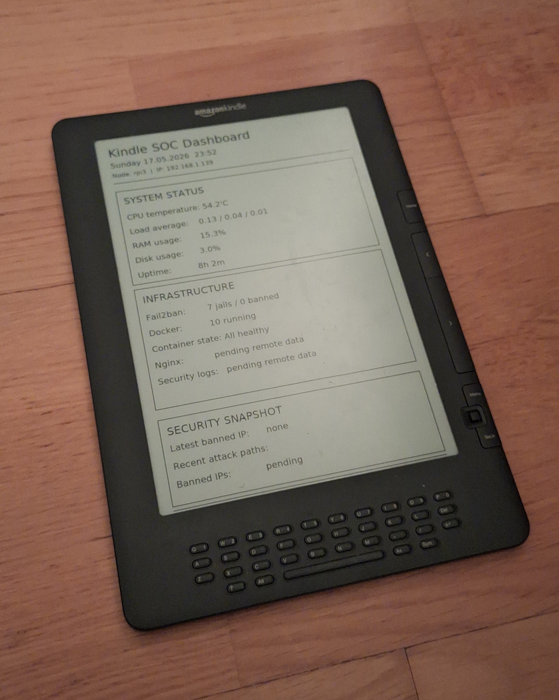

# Kindle DX SOC Dashboard

A repurposed Amazon Kindle DX Graphite used as an e-paper SOC-style dashboard for monitoring self-hosted Raspberry Pi infrastructure.

The dashboard is rendered with Python and Pillow on a Raspberry Pi 3, copied to the Kindle over USB mass storage, and displayed through the Kindle's custom screensaver system.

## Features

- 9.7" e-paper infrastructure dashboard
- Raspberry Pi 3 based image rendering
- Kindle DX Graphite repurposing
- Python + Pillow dashboard generation
- Remote Fail2ban status over SSH
- Docker container status over SSH
- Nginx/security log section prepared for future use
- USB mass-storage based update pipeline

## Hardware

- Amazon Kindle DX Graphite
- Raspberry Pi 3
- USB cable
- Raspberry Pi OS Lite Legacy / Bullseye

## Current Architecture

```text
Remote server / Raspberry Pi infrastructure
        |
        | SSH
        v
Raspberry Pi 3
        |
        | Python dashboard renderer
        v
dashboard.png
        |
        | USB mass storage
        v
Kindle DX Graphite screensaver
```

## SSH / USBNetwork Breakthrough

USBNetwork was eventually successfully enabled on the Kindle DX Graphite.

The Kindle appears on the Raspberry Pi as a USB Ethernet gadget:

```text
usb0
Kindle IP: 192.168.2.2
Host IP:   192.168.2.1
```

SSH access works as root over USB Ethernet.

```bash
ssh root@192.168.2.2
```

This enables direct file transfer with `scp` and remote control experiments through Kindle's internal `lipc` interface.

### Current findings

- `scp` to `/mnt/us/linkss/screensavers/` works correctly.
- `/etc/init.d/framework restart` successfully restarts the Kindle framework.
- USB Ethernet networking works reliably through `g_ether`.
- `powerd` exposes properties such as:
  - `wakeUp`
  - `deferSuspend`
  - `touchScreenSaverTimeout`
  - `preventScreenSaver`
- `powerButton` is not available as a writable property on this firmware.
- `framework restart` alone does not automatically trigger screensaver mode.
- Automatic screensaver refresh without using the physical sleep button is still under investigation.

### Kindle system details

```text
Linux kindle 2.6.22.19-lab126 #3 PREEMPT Tue Jun 8 19:03:49 PDT 2010 armv6l unknown
```

```text
System Software Version: 008-TN2.1-049546
Tue Jun 8 19:07:59 PDT 2010
```

### Interesting mountpoints

```text
fsp on /opt/amazon/screen_saver/824x1200 type fuse.fsp
fsp on /mnt/us type fuse.fsp
```

These mountpoints appear to be directly related to the Kindle framework's screensaver handling.

## Fully Automated Screensaver Refresh

The Kindle dashboard refresh process is now fully automated over SSH.

The Raspberry Pi 3:

1. Generates a new dashboard image with Python/Pillow
2. Transfers the image directly to the Kindle over SCP
3. Detects the current Kindle power state through `lipc`
4. Triggers Kindle power button events through `powerd_test`

### Important behavior

The Kindle DX firmware only refreshes the active screensaver image during a screensaver state transition.

This means that when the Kindle is already in screensaver mode, the refresh process performs:

```text
screensaver -> wake -> screensaver
```

to force the Kindle framework to reload the updated image.

This behavior appears to be related to proprietary Lab126 framework caching and e-paper refresh handling.

### Scheduled Automatic Updates

The dashboard refresh pipeline is now fully automated through a user-level systemd timer on the Raspberry Pi 3.

Current refresh interval:

```text
every 15 minutes
```

The timer automatically:

1. Generates a fresh dashboard image
2. Transfers the image to the Kindle DX over SCP
3. Detects the current Kindle power state
4. Performs the required screensaver refresh sequence automatically

This effectively turns the Kindle DX into a continuously updating low-power infrastructure monitoring appliance.

## 📸 Preview



## Roadmap

### High Priority

- Test Kindle DX WiFi connectivity on a modern home network
- Enable SSH/SCP access to the Kindle over WiFi
- Convert the dashboard update pipeline from USB Ethernet to LAN/WiFi
- Run the Kindle as a standalone e-paper SOC display with only power connected

### Later / Experimental

- Investigate direct screensaver refresh without Home screen transition
- Investigate Lab126 framework signaling
- Investigate direct framebuffer or e-ink refresh control

## Standalone Pi Zero W Bridge Mode

The project was later migrated from a Raspberry Pi 3 test setup to a dedicated Raspberry Pi Zero W bridge device.

Current architecture:

```text
Raspberry Pi 4 (monitored server)
        ↓ WiFi / LAN
Raspberry Pi Zero W
        ↓ USB Ethernet
Kindle DX Graphite
```

The Pi Zero W now handles:

- dashboard rendering
- SSH telemetry collection
- Fail2ban and Nginx analysis
- SCP image transfer
- Kindle screensaver refresh triggering
- automated systemd timer refreshes

This removes the dependency on a separate development workstation and turns the setup into a mostly standalone embedded monitoring device.

### Pi Zero W Responsibilities

- Connects to the home network over WiFi
- Maintains USB Ethernet connectivity to the Kindle
- Generates `dashboard.png`
- Pushes the image to the Kindle over SCP
- Triggers Kindle screensaver refreshes automatically

### Current Hardware Layout

```text
Kindle DX Graphite
+
Raspberry Pi Zero W
+
single power connection
```

The Kindle itself does not use native WiFi networking.  
Instead, the Pi Zero W acts as the network-aware bridge device.

## Documentation

Additional technical notes and troubleshooting details:

- [Kindle Debugging Notes](docs/kindle-debugging-notes.md)
- [systemd Timer Setup](docs/systemd-timer.md)
- [USB Ethernet After Reboot](docs/usb-ethernet-reboot.md)

These documents include:

- Kindle USBNetwork reverse engineering
- Dropbear SSH authentication troubleshooting
- Kindle power management behavior
- Automated screensaver refresh workflow
- USB Ethernet persistence handling
- systemd timer automation
- Standalone Pi Zero W bridge deployment

## Current Limitations

- Fully automatic screensaver refresh without using the physical sleep button is still under investigation.
- Kindle power management and screensaver triggering behavior are controlled by proprietary Lab126 framework components.
- Some `lipc` power management properties are readable but not writable on firmware 2.5.5.
- The Kindle framework does not automatically switch to screensaver mode after a framework restart.
- The project currently relies on a USB connection between the Raspberry Pi and the Kindle.

## Lessons Learned

- Kindle DX USB networking was unreliable on this specific firmware/device combination.
- Raspberry Pi OS Bullseye proved significantly more stable than newer Bookworm releases for this embedded use case.
- E-paper UI design requires much larger spacing and simpler layouts than traditional displays.
- USB mass-storage based updates turned out to be more reliable than attempting direct SSH control of the Kindle.

## Status

Working prototype.
