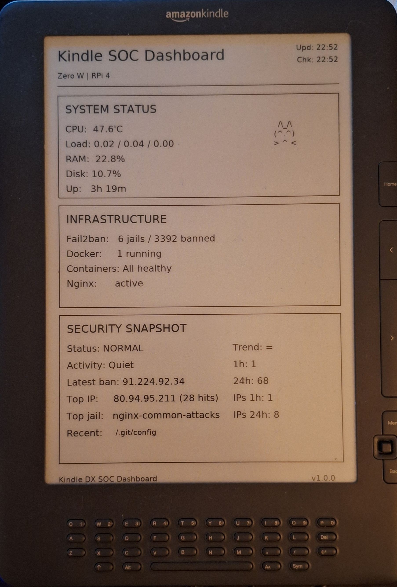
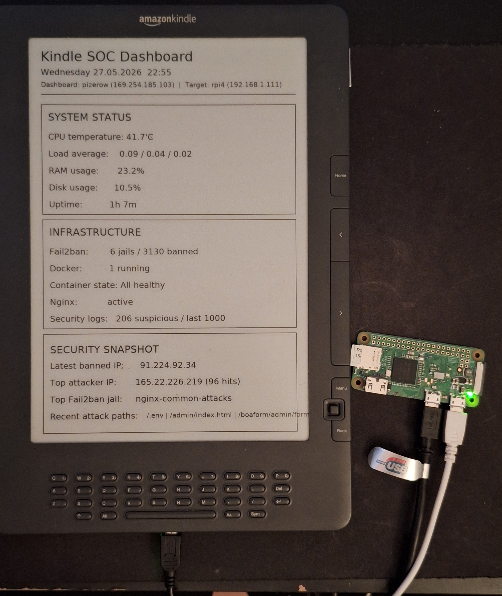

# Kindle DX SOC Dashboard

A Raspberry Pi powered Security Operations Center (SOC) dashboard for the Amazon Kindle DX Graphite.



The Kindle DX SOC Dashboard turns a jailbroken Amazon Kindle DX Graphite into a dedicated e-paper security monitoring display.

The dashboard is generated on a Raspberry Pi Zero W using live infrastructure and security data collected from a Raspberry Pi 4. It provides an always-on overview of system health, Docker services, Fail2ban statistics, Nginx status and external attack activity.

The display is updated over Kindle USBNetwork using SSH, SCP and direct e-ink rendering with `eips`.

## Technology Stack

| Component | Technology |
|----------|------------|
| Display | Amazon Kindle DX Graphite |
| Dashboard | Python + Pillow |
| Bridge | Raspberry Pi Zero W |
| Monitoring | Raspberry Pi 4 |
| Transport | SSH / SCP |
| Display refresh | `eips` |
| Security | Fail2ban + Nginx |

Tested on:

- Kindle DX Graphite (Firmware 2.5.5)

## Features

- 9.7" e-paper SOC-style dashboard
- Raspberry Pi Zero W dashboard generator
- Raspberry Pi 4 infrastructure monitoring target
- Python + Pillow dashboard rendering
- Direct Kindle e-ink refresh using `eips`
- USBNetwork based SSH/SCP update pipeline
- Docker container health monitoring
- Fail2ban jail and ban statistics
- Nginx status monitoring
- External attack detection from Nginx access logs
- Security status classification
- Attack activity classification
- Attack trend indicator (`^`, `=`, `v`)
- Unique attacker IP statistics (1h / 24h)
- Recent attack path summary
- Top attacker IP
- Top Fail2ban jail
- `Upd` / `Chk` timestamps
- ASCII SOC Cat visual status indicator

## Hardware

- Amazon Kindle DX Graphite
- Raspberry Pi 3 (original development platform)
- Raspberry Pi Zero W (current standalone bridge device)
- USB cable
- Raspberry Pi OS Lite Legacy / Bullseye

## Architecture

### Hardware



The Raspberry Pi Zero W acts as a dedicated dashboard bridge between the monitored infrastructure and the Kindle DX Graphite.

The Raspberry Pi 4 hosts the monitored services while the Raspberry Pi Zero W periodically collects the required information, renders the dashboard and updates the Kindle display over USB Ethernet.

```text
Internet
      │
      ▼
 Raspberry Pi 4
 ├── Docker
 ├── Fail2ban
 ├── Nginx
 └── Security logs
      │
      │ SSH
      ▼
 Raspberry Pi Zero W
 ├── Python
 ├── Pillow
 ├── SHA-256 fingerprint
 └── Dashboard generator
      │
      │ USB Ethernet
      ▼
 Kindle DX Graphite
```

### Components

| Device | Purpose |
|--------|---------|
| Raspberry Pi 4 | Monitored infrastructure host |
| Raspberry Pi Zero W | Dashboard generation and Kindle bridge |
| Kindle DX Graphite | Dedicated e-ink SOC display |

## Dashboard Overview

The dashboard is divided into three main sections:

| Section | Description |
|---------|-------------|
| **System Status** | Local Raspberry Pi Zero W health including CPU temperature, load average, memory usage, disk usage and uptime. |
| **Infrastructure** | Status of monitored Raspberry Pi 4 services including Docker, Fail2ban and Nginx. |
| **Security Snapshot** | Live security summary showing attack status, trend, activity, recent attackers and attack statistics. |

### Security indicators

| Indicator | Meaning |
|----------|---------|
| **Status** | Overall security classification (NORMAL / ELEVATED / ACTIVE ATTACK). |
| **Trend** | Whether attack activity is increasing (`^`), stable (`=`) or decreasing (`v`). |
| **Activity** | Human-readable summary of the current attack level (Quiet / Scanning / Heavy probing). |
| **1h / 24h** | Suspicious requests detected during the last hour and last 24 hours. |
| **IPs** | Number of unique attacking IP addresses. |
| **Latest ban** | Most recently banned IP address by Fail2ban. |
| **Top IP** | Most active attacking IP address. |
| **Top jail** | Fail2ban jail with the highest ban count. |
| **Recent** | Most recent suspicious request paths detected from Nginx logs. |

## SOC Cat – Visual Security Indicator

The dashboard includes a small ASCII cat ("SOC Cat") that provides an immediate visual indication of the current security posture.

Rather than displaying raw metrics alone, the cat reflects the overall system state based on the current security status, attack trend and activity level.

| Face | Meaning |
|------|---------|
| `^.^` | Quiet system with normal activity |
| `o.o` | Increased activity or scanning detected |
| `O.O` | Elevated security state |
| `>.<` | Active attack with increasing activity |
| `-.-` | Situation stabilizing after elevated activity |

SOC Cat is intentionally subtle. It acts as a quick visual indicator while the detailed metrics remain available in the Security Snapshot section.

## SSH / USBNetwork Breakthrough

USBNetwork was eventually successfully enabled on the Kindle DX Graphite.

The Kindle appears on the Raspberry Pi as a USB Ethernet gadget:

```text
usb0
Kindle IP: 192.168.2.2
Host IP:   192.168.2.1
```

SSH access works as root over USB Ethernet.

```bash
ssh root@192.168.2.2
```

This enables direct file transfer with `scp` and remote control experiments through Kindle's internal `lipc` interface.

### Current findings

- `scp` to `/mnt/us/linkss/screensavers/` works correctly.
- `/etc/init.d/framework restart` successfully restarts the Kindle framework.
- USB Ethernet networking works reliably through `g_ether`.
- `powerd` exposes properties such as:
  - `wakeUp`
  - `deferSuspend`
  - `touchScreenSaverTimeout`
  - `preventScreenSaver`
- `powerButton` is not available as a writable property on this firmware.
- `framework restart` alone does not automatically trigger screensaver mode.

### Kindle system details

```text
Linux kindle 2.6.22.19-lab126 #3 PREEMPT Tue Jun 8 19:03:49 PDT 2010 armv6l unknown
```

```text
System Software Version: 008-TN2.1-049546
Tue Jun 8 19:07:59 PDT 2010
```

### Interesting mountpoints

```text
fsp on /opt/amazon/screen_saver/824x1200 type fuse.fsp
fsp on /mnt/us type fuse.fsp
```

These mountpoints appear to be directly related to the Kindle framework's screensaver handling.


## Intelligent Dashboard Refresh

The Raspberry Pi Zero W updates the Kindle dashboard fully over SSH.

The refresh workflow is:

1. Generate a new dashboard image with Python/Pillow.
2. Build a SHA-256 fingerprint from monitored dashboard data.
3. Compare the fingerprint with the previous execution.
4. If nothing has changed, skip the Kindle refresh.
5. If monitored data has changed:
   - transfer the new image with `scp`
   - refresh the Kindle display directly using `eips`

This minimizes unnecessary e-ink refreshes while keeping the displayed information current.

## Boot Sequence

For reliable USB networking between the Raspberry Pi Zero W and the Kindle DX Graphite, use the following startup order:

1. Boot the Raspberry Pi Zero W.
2. Wait until the Raspberry Pi Zero W has fully started (SSH available).
3. Boot the Kindle **without the USB cable connected**.
4. Wait until the Kindle reaches the Home screen.
5. Connect the USB cable between the Kindle and the Raspberry Pi Zero W.
6. Verify that the USB network is available:

```bash
ping 192.168.2.2
```

If the Kindle responds, the dashboard can be updated normally.

> **Note**
>
> During development it was discovered that connecting the Kindle too early may prevent the USB Ethernet interface from initializing correctly.
>
> If the USB network does not appear:
>
> - disconnect the USB cable
> - reboot both the Raspberry Pi Zero W and the Kindle
> - wait until both devices have fully booted
> - reconnect the USB cable

### Dashboard timestamps

Two timestamps are shown in the dashboard header:

- **Upd** — Last time monitored data actually changed.
- **Chk** — Last time the dashboard checked the monitored system.

This makes it possible to distinguish between a stable system and a stalled dashboard process.


### Important behavior

The Kindle DX firmware only refreshes the active screensaver image during a screensaver state transition.

This means that when the Kindle is already in screensaver mode, the refresh process performs:

```text
screensaver -> wake -> screensaver
```

to force the Kindle framework to reload the updated image.

This behavior appears to be related to proprietary Lab126 framework caching and e-paper refresh handling.

### Scheduled Automatic Updates

The dashboard refresh pipeline is now fully automated through a user-level systemd timer on the Raspberry Pi 3.

Current refresh interval:

```text
every 15 minutes
```

The timer automatically:

1. Generates a fresh dashboard image.
2. Builds a SHA-256 fingerprint from the monitored dashboard data.
3. Skips the refresh if nothing has changed.
4. Transfers the updated image to the Kindle DX over `scp`.
5. Refreshes the e-ink display directly using `eips`.

This effectively turns the Kindle DX into a low-power, always-on SOC dashboard with intelligent refresh logic that minimizes unnecessary e-ink updates.

## Roadmap

The project will continue to evolve as a dedicated Raspberry Pi powered SOC dashboard.

### Planned

- Historical attack statistics
- Attack history database (SQLite)
- Long-term attack trend analysis
- Improved SOC Cat behavior
- Infrastructure health scoring
- Additional security indicators
- Architecture diagram
- Dashboard customization options

### Future ideas

- GeoIP based attack statistics
- Country distribution
- Daily / weekly summaries
- Telegram integration
- Web-based dashboard
- Multiple monitored hosts

## Documentation

Additional technical notes and troubleshooting details:

- [Kindle Debugging Notes](docs/kindle-debugging-notes.md)
- [systemd Timer Setup](docs/systemd-timer.md)
- [USB Ethernet After Reboot](docs/usb-ethernet-reboot.md)
- [Pi Zero W Bridge Mode](docs/pi-zero-w-bridge.md)

These documents include:

- Kindle USBNetwork reverse engineering
- Dropbear SSH authentication troubleshooting
- Kindle power management behavior
- Automated screensaver refresh workflow
- USB Ethernet persistence handling
- systemd timer automation
- Standalone Pi Zero W bridge deployment

## Current Limitations

- Direct Kindle screensaver refresh without the temporary Home screen transition is still under investigation.
- Kindle power management and screensaver triggering behavior are controlled by proprietary Lab126 framework components.
- Some `lipc` power management properties are readable but not writable on firmware 2.5.5.
- The Kindle framework does not automatically switch to screensaver mode after a framework restart.
- The current standalone architecture relies on USB Ethernet connectivity between the Raspberry Pi Zero W and the Kindle DX Graphite.

## Lessons Learned

- Kindle DX USB networking was unreliable on this specific firmware/device combination.
- Raspberry Pi OS Bullseye proved significantly more stable than newer Bookworm releases for this embedded use case.
- E-paper UI design requires much larger spacing and simpler layouts than traditional displays.
SCP-based dashboard transfers over USB Ethernet combined with direct `eips` rendering proved significantly more reliable, faster and simpler than the earlier USB mass-storage and power-button based workflow.

## Tested Hardware

- Kindle DX Graphite (D00801)
- Raspberry Pi Zero W
- Raspberry Pi 3
- Raspberry Pi 4
- Raspberry Pi OS Bullseye

## Status

Current stable release: v1.0.0

## License

This project is licensed under the MIT License. See the `LICENSE` file for details.
